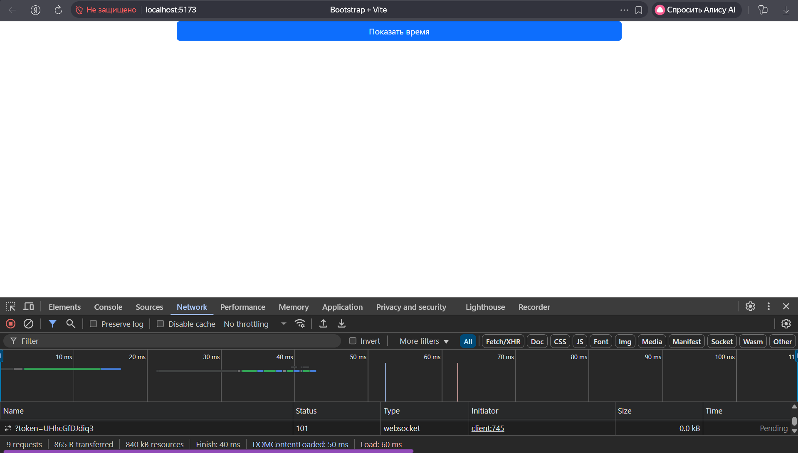
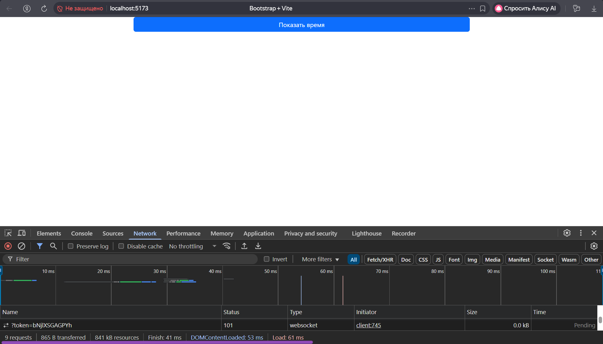
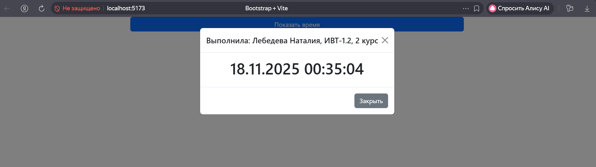

# Отчет по сборке Bootstrap-приложения с использованием Vite

## Цель работы
Создание проекта с использованием сборщика Vite для построения страницы с Bootstrap и интеграцией скрипта обновления времени с помощью Luxon, с минимизацией размера бандла.

## Выполненные задачи

### 1. Создание проекта
- Создан новый проект с использованием Vite
- Установлены необходимые зависимости

### 2. Установка зависимостей
```bash
npm install
npm install bootstrap @popperjs/core luxon
```

### 3. Настройка Vite для работы с Bootstrap
- Настроен импорт только необходимых компонентов Bootstrap
- Реализована кастомизация стилей

## Команды для сборки

### Запуск в режиме разработки
```bash
npm run dev
```

### Сборка проекта
```bash
npm run build
```

### Просмотр собранного проекта
```bash
npm run preview
```

## Результаты сборки

### Минимальная версия (импорт только необходимых компонентов)


### Полная версия (импорт всех компонентов Bootstrap)


## Внешний вид интерфейса


---

__Дисциплина:__   
Веб-проектирование и веб-языки 

__Выполнила:__   
Лебедева Наталия, ИВТ-1.2, 2 курс
